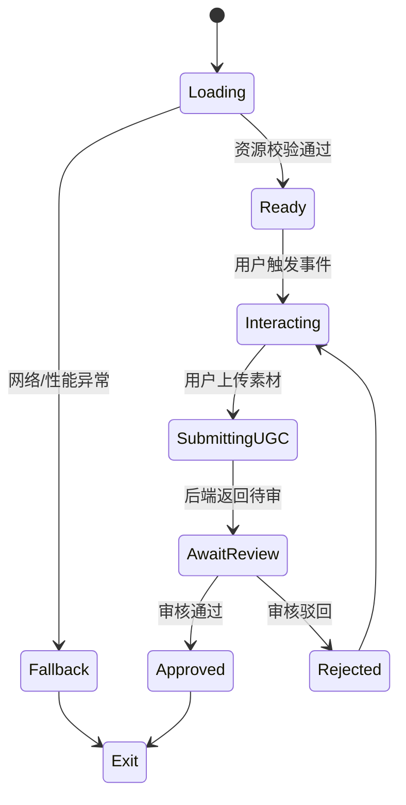
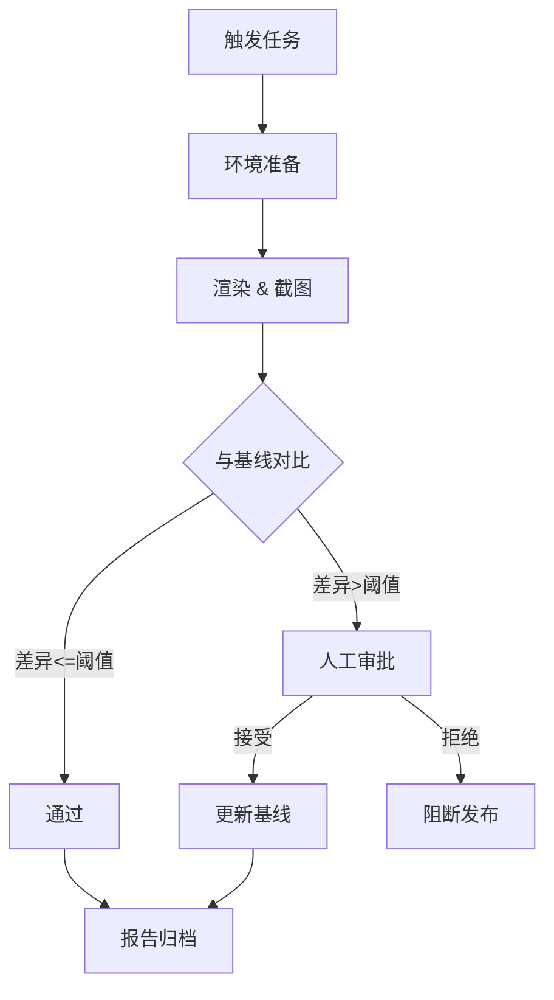
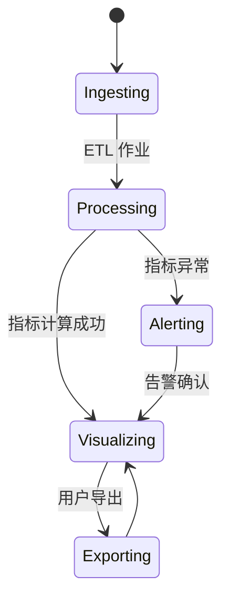

# 技术需求说明：互动体验关键触点

## 背景与目标
- **项目背景**：构建覆盖 H5/WebGL 体验、自动化截图比对与数据仪表板的闭环能力，支撑运营活动的高频迭代与可视化质量风控。
- **总体 KPI**：
  - 活动期间 H5/WebGL 体验 99.5% 成功率，加载耗时 P95 < 3.5s。
  - 自动化截图比对覆盖率 ≥ 95%，误报率 < 3%。
  - 数据仪表板延迟 < 5 分钟，核心指标准确率 ≥ 99%。
- **风控要求**：及时发现渲染异常、UGC 审核风险和指标异常波动，实现分钟级告警。

## 冲刺节奏与责任人
| 交付项 | 内容摘要 | 周次 | 负责人 |
| --- | --- | --- | --- |
| Sprint 1 | H5/WebGL 体验架构设计、核心渲染链路 PoC、性能埋点方案 | 第 1 周 | 前端负责人 A | 
| Sprint 2 | 自动化截图比对流水线 MVP、CI 集成、阈值配置界面草稿 | 第 2 周 | 测试负责人 B |
| Sprint 3 | 数据仪表板数据模型、可视化模板、指标告警规则 | 第 3 周 | 数据负责人 C |
| Sprint 4 | 全链路联调（含 UGC 提交流程与监控上报）、回归测试与验收 | 第 4 周 | 项目经理 D |

---

## 触点一：H5/WebGL 互动体验

### 功能列表
1. **场景加载与资源管理**：按需加载模型、纹理和音视频资源，支持增量更新。
2. **交互引擎**：提供手势、重力感应、音频驱动等交互模式，支持脚本化配置。
3. **个性化渲染**：基于用户画像动态下发材质/光照参数，兼容移动端主流机型。
4. **UGC 提交流程**：允许用户上传截图或短视频，触发审核流程并反馈状态。
5. **风控提示层**：异常网络、低性能设备时给出退化或引导。

### 状态流程

### 数据契约
| 模块 | 方向 | 字段 | 类型 | 说明 |
| --- | --- | --- | --- | --- |
| 资源拉取 | 客户端 → CDN | `bundle_version` | string | 构建版本号 |
| 资源拉取 | CDN → 客户端 | `asset_manifest` | json | 资源列表及哈希 |
| 交互埋点 | 客户端 → 监控服务 | `event_id` | string | 事件枚举（load_start, load_success 等） |
| 交互埋点 | 客户端 → 监控服务 | `latency_ms` | number | 时延数据 |
| UGC 上传 | 客户端 → 后端 | `user_id` | string | 用户唯一标识 |
| UGC 上传 | 客户端 → 后端 | `ugc_payload` | file/json | 上传内容（压缩） |
| UGC 审核回执 | 后端 → 客户端 | `review_status` | enum | pending/approved/rejected |
| 性能上报 | 客户端 → APM | `device_profile` | json | 设备信息、FPS、内存 |

### 与后端/第三方接口
- **UGC 提交流程**（REST）：
  - `POST /api/v1/ugc`，字段：`user_id`(string)、`session_id`(string)、`content_type`(enum:image/video)、`file_url`(string)、`meta`(json: {scene_id, device_profile})。频率：用户交互触发，峰值 100 QPS。
  - `GET /api/v1/ugc/{session_id}/status`，字段：`review_status`(enum)、`moderator_reason`(string)、`updated_at`(ISO8601)。轮询频率：客户端 30s 一次，超时 5 分钟。
- **APM 监控上报**（gRPC/批量）：
  - `ReportPerformance(stream)`，payload：`events[]`，每个事件含 `timestamp`(ms)、`event_id`、`latency_ms`、`fps`、`memory_mb`、`device_tier`。批量发送间隔 60s 或队列满 20 条。

### 性能指标
- 首屏加载 P95 < 3.5s；交互响应 < 100ms；内存占用 < 350MB；FPS P90 ≥ 45。
- UGC 上传成功率 ≥ 98%，审核结果返回耗时 P90 < 2 分钟。

### 验收标准与测试策略
- **功能测试**：覆盖 3 大场景（高性能、中端、低端设备），完成场景切换、交互、UGC 上传全链路；UGC 审核模拟通过/拒绝。
- **性能测试**：利用 WebPageTest、Lighthouse 测量加载指标；使用真实机型跑 30 分钟压力，验证 FPS 与内存波动；APM 数据核对。
- **可视化一致性**：与设计稿进行像素级对比（参照自动化截图流程），允许 2% 差异；不同分辨率截图对比。
- **验收**：满足性能指标，Bug 率 < 0.5/人日，风控告警通过演练。

---

## 触点二：自动化截图比对流水线

### 功能列表
1. **截图采集**：CI 中运行无头浏览器或 WebGL 渲染器，按场景路径生成截图。
2. **基线管理**：支持多分支、多分辨率基线存储与回滚。
3. **差异分析**：像素差异计算、阈值配置、热区标记。
4. **报告输出**：生成 HTML 报告、Slack/飞书推送摘要。
5. **审批流**：差异超阈值时发起审批，允许指定负责人接受/拒绝。

### 状态流程

### 数据契约
| 模块 | 字段 | 类型 | 说明 |
| --- | --- | --- | --- |
| 任务触发 | `pipeline_id` | string | CI 流水线标识 |
| 渲染配置 | `viewport` | json | `{width,height,device_scale}` |
| 对比结果 | `diff_ratio` | float | 像素差异占比 |
| 对比结果 | `diff_heatmap_url` | string | 差异图存储路径 |
| 审批记录 | `approver` | string | 审批人 |
| 审批记录 | `decision` | enum | accept/reject |
| 报告 | `report_url` | string | HTML 报告地址 |

### 与后端/第三方接口
- **CI 平台 Webhook**：`POST /webhook/visual-regression`，字段：`pipeline_id`、`branch`、`commit_id`、`triggered_by`。频率：每次 CI 任务触发。
- **对象存储服务**：`PUT /storage/screenshots/{pipeline_id}/{timestamp}` 上传截图；`GET` 同路径下载。限制：单文件 < 10MB。
- **协同通知**（第三方机器人 API）：`POST /bots/notify`，字段：`title`、`diff_ratio`、`report_url`、`approver_list`。频率：差异超阈值时发送。

### 性能指标
- 单次对比流程耗时 < 8 分钟；截图生成成功率 ≥ 99%；自动审批命中率（无需人工） ≥ 80%。

### 验收标准与测试策略
- **功能测试**：模拟 5 个典型场景（H5 页面、WebGL 场景、不同分辨率），验证基线切换、差异报告、审批流。
- **性能测试**：并发 5 个 CI 任务，确保总时长满足指标；对象存储吞吐测试。
- **可视化一致性**：对比误报率/漏报率统计，要求误报 < 3%，漏报 < 1%；随机抽取 10 份报告复核。
- **验收**：CI 流水线接入率 100%，审批流程在 2 个项目中试运行通过。

---

## 触点三：数据仪表板

### 功能列表
1. **实时指标展示**：展示访问量、互动完成率、UGC 提交量、审核通过率等。
2. **性能监控**：可视化加载耗时、FPS、错误率，提供阈值告警。
3. **告警联动**：与监控服务对接，推送异常到飞书/邮件。
4. **自助钻取**：按时间/渠道/设备分组分析，可导出 CSV。
5. **风控视图**：UGC 审核状态、违规类型分布、黑名单趋势。

### 状态流程

### 数据契约
| 数据源 | 字段 | 类型 | 说明 |
| --- | --- | --- | --- |
| 埋点流 | `event_time` | timestamp | 事件时间戳 |
| 埋点流 | `event_name` | string | load_success、interaction_complete 等 |
| 审核服务 | `ugc_id` | string | 内容 ID |
| 审核服务 | `review_status` | enum | pending/approved/rejected |
| 审核服务 | `violation_type` | string | 违规分类 |
| APM | `metric_name` | string | `load_p95`, `fps_p90` |
| APM | `metric_value` | number | 指标值 |
| 告警配置 | `threshold` | number | 告警阈值 |
| 告警配置 | `cooldown_min` | number | 冷却时间 |

### 与后端/第三方接口
- **数据接入层（Kafka/HTTP）**：
  - `Kafka Topic: fe.events`，字段如上，生产频率：1000 条/分钟。
  - `POST /api/v1/metrics`（备用 HTTP）用于补数，字段：`metric_name`、`metric_value`、`timestamp`。
- **监控告警服务**：`POST /alerts/push`，字段：`metric_name`、`current_value`、`threshold`、`severity`、`dashboard_url`。频率：超过阈值即刻触发，最小间隔 5 分钟。
- **导出服务**：`GET /api/v1/export?metric=...&range=...`，返回 CSV 流，限制 10000 行。

### 性能指标
- 数据延迟 P95 < 5 分钟；仪表板查询响应 < 2 秒；告警到达延迟 < 60 秒。
- 指标准确率 ≥ 99%，导出成功率 ≥ 99.5%。

### 验收标准与测试策略
- **功能测试**：构建 10 条模拟数据，验证实时刷新、过滤、钻取、导出；模拟审核状态变化与违规类型展示。
- **性能测试**：压测 200 并发查询，响应时间满足指标；Kafka 消费延迟监控。
- **可视化一致性**：对比设计稿颜色、字体、布局，偏差 < 1px；多浏览器截图检查。
- **验收**：告警联动演练通过（飞书通知可达率 100%），核心指标与离线报表差异 < 1%。

---

## 风险与缓解措施
- **资源突增导致加载超时**：预设资源压缩策略与 CDN 边缘缓存；设置备用轻量场景。
- **自动化比对误报**：引入动态阈值与结构化差异分析；定期校准基线。
- **数据延迟**：ETL 作业增加监控，支持自动扩容；关键告警提供手动重跑脚本。

## 附录：测试环境准备
- 提供 Dev、Staging、Production 三套环境，对应独立资源与监控命名空间。
- CI 中使用 Docker 镜像 `node:20-browsers` 运行截图任务；Staging 对接灰度审核服务。
